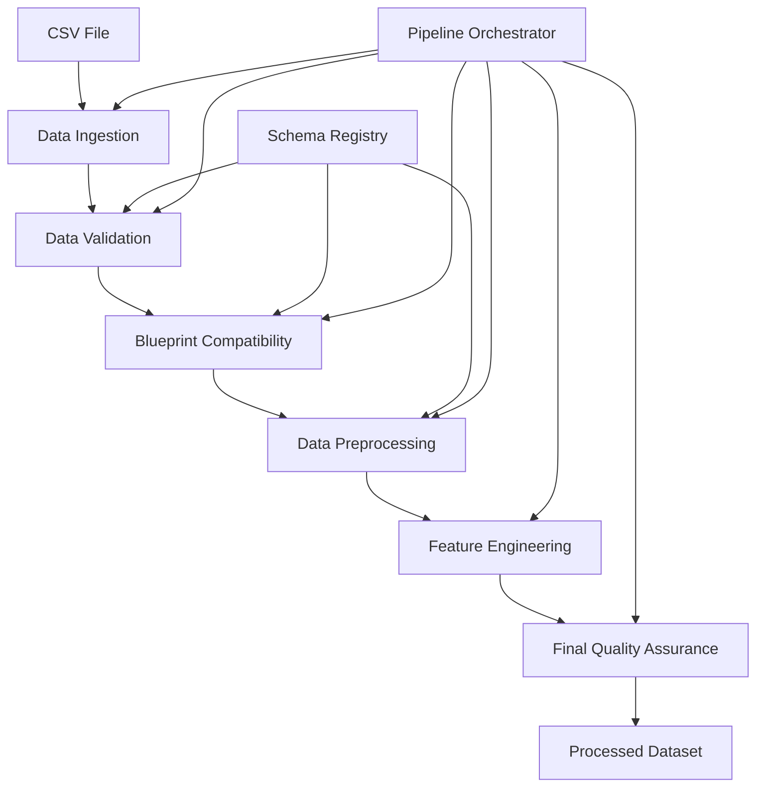

# Tracer Framework - Data Pipeline Architecture

## Overview

The Tracer Framework's data pipeline provides a robust, scalable, and secure system for processing datasets for machine learning blueprints. The architecture follows enterprise-grade data engineering best practices with comprehensive validation, feature engineering, and quality assurance.

## Architecture Components

### 📁 Core Components

```
src/tracer/core/
├── __init__.py           # Package exports and main interface
├── models.py             # Data models and type definitions
├── pipeline.py           # High-level pipeline interface
├── orchestrator.py       # Pipeline orchestration and workflow management
├── ingestion.py          # Data ingestion service (CSV processing)
├── validation.py         # Data validation and quality checks
├── preprocessing.py      # Data preprocessing and feature engineering
└── schemas.py            # Data schemas and validation rules
```

### 🔄 Data Flow



## Key Features

### 🚀 **High-Performance Data Ingestion**
- **Async CSV Processing**: Memory-efficient streaming for large files (up to 100MB)
- **Automatic Encoding Detection**: Support for UTF-8, Latin-1, CP1252
- **Content Validation**: File integrity checks and format validation
- **Metadata Extraction**: Automatic schema inference and column analysis

### 🛡️ **Comprehensive Data Validation**
- **Schema Validation**: Marshmallow-based schema validation with business rules
- **Data Quality Checks**: Completeness, uniqueness, range, pattern validation
- **Statistical Anomaly Detection**: IQR and Z-score based outlier detection
- **Blueprint Compatibility**: Automatic compatibility assessment with ML blueprints

### ⚙️ **Advanced Data Preprocessing**
- **Intelligent Missing Value Handling**: Automatic strategy selection based on data characteristics
- **Outlier Treatment**: Capping instead of removal to preserve data integrity  
- **Feature Engineering**: Blueprint-specific automated feature generation
- **Smart Encoding**: Automatic categorical variable encoding (label/one-hot/target)
- **Robust Scaling**: RobustScaler for outlier-resistant normalization

### 🎯 **Blueprint-Specific Processing**
- **Customer Churn Detection**: 9 engineered features including recency, tenure, engagement
- **Revenue Projection**: Time series features, seasonality, growth rates
- **Price Optimization**: Elasticity indicators, demand trends, positioning features

## Usage Examples

### Basic Pipeline Usage

```python
from tracer.core import DataPipeline

# Initialize pipeline
pipeline = DataPipeline()

# Process a dataset
processed_data, state = await pipeline.process_file(
    file_path="customer_data.csv",
    blueprint_name="customer_churn"
)

# Check results
print(f"Processing status: {state.status}")
print(f"Data shape: {processed_data.shape}")
print(f"Features created: {len(state.feature_engineering.features_created)}")
```

### Advanced Configuration

```python
# Custom preprocessing configuration
config = {
    'missing_value_strategy': 'auto',
    'outlier_method': 'iqr', 
    'encoding_strategy': 'auto',
    'scaling_method': 'robust'
}

processed_data, state = await pipeline.process_file(
    file_path="data.csv",
    blueprint_name="customer_churn",
    preprocessing_config=config
)
```

### Batch Processing

```python
# Process multiple files concurrently
file_configs = [
    ("customers_jan.csv", "customer_churn"),
    ("customers_feb.csv", "customer_churn"),
    ("revenue_data.csv", "revenue_projection")
]

results = await pipeline.process_batch(file_configs, max_concurrent=3)
```

### Stream Processing (Web Uploads)

```python
# Process file streams from web uploads
processed_data, state = await pipeline.process_stream(
    file_stream=uploaded_file,
    filename="uploaded_data.csv",
    blueprint_name="customer_churn",
    content_length=file_size
)
```

## Blueprint Specifications

### Customer Churn Detection

**Required Fields:**
- `customer_id`: Unique customer identifier
- `last_activity_date`: Most recent interaction timestamp  
- `account_created_date`: Registration timestamp
- `total_value`: Lifetime spend or usage metrics

**Optional Fields:**
- `support_tickets`: Issue frequency data
- `feature_usage_count`: Product engagement metrics
- `plan_type`: Subscription tier classification

**Generated Features:**
1. `days_since_last_activity` - Recency metric
2. `account_tenure_days` - Customer lifetime
3. `daily_value_rate` - Value per day metric
4. `support_intensity` - Support tickets per month
5. `feature_usage_rate` - Daily feature usage
6. `activity_recency_score` - Exponential decay score
7. `value_tier` - Customer value quartile
8. `plan_value_score` - Plan hierarchy encoding
9. `engagement_score` - Composite engagement metric

### Revenue Projection

**Required Fields:**
- `date`: Time series timestamps
- `revenue`: Historical revenue values
- `customer_count`: Active user metrics (optional but enhances accuracy)

**Generated Features:**
- Moving averages (7, 30, 90 days)
- Growth rates (1d, 7d, 30d)
- Seasonal components (day/week/month/quarter)
- Volatility measures (rolling standard deviation)

### Price Optimization

**Required Fields:**
- `product_id`: Product identifier
- `price`: Historical price points  
- `quantity_sold`: Transaction volume
- `date`: Transaction timestamps

**Generated Features:**
- Revenue calculations
- Price elasticity indicators
- Demand trends
- Price positioning metrics

## Data Quality Standards

### Quality Thresholds
- **Completeness**: 95%+ for critical fields
- **Uniqueness**: 100% for identifier fields
- **Validity**: 98%+ for format compliance
- **Overall Quality Score**: 80+ required for processing

### Validation Rules
- **Critical Issues**: Stop processing immediately
- **High Issues**: ≤5 allowed with warnings
- **Medium/Low Issues**: Logged but processing continues

### Statistical Validation
- **IQR Outliers**: Values beyond Q1-1.5×IQR or Q3+1.5×IQR  
- **Z-Score Outliers**: |Z| > 3.0
- **Range Validation**: Business-specific min/max constraints
- **Pattern Matching**: Regex validation for structured fields

## Performance Characteristics

### Processing Speeds
- **Ingestion**: ~50 MB/s for CSV files
- **Validation**: ~30 MB/s for quality checks
- **Preprocessing**: ~20 MB/s (varies by blueprint complexity)
- **Feature Engineering**: Blueprint-dependent

### Memory Efficiency
- **Streaming Processing**: Memory usage independent of file size
- **Data Type Optimization**: Automatic dtype reduction (50-80% memory savings)
- **Categorical Optimization**: Automatic category conversion for repeated values

### Scalability
- **Concurrent Pipelines**: Configurable (default: 3-5 concurrent)
- **File Size Limits**: 100MB per file (configurable)
- **Processing Time**: Linear scaling with data size

## Error Handling & Recovery

### Pipeline States
- `PENDING`: Pipeline queued for processing
- `IN_PROGRESS`: Currently processing  
- `COMPLETED`: Successfully completed
- `FAILED`: Processing failed with errors
- `CANCELLED`: Manually cancelled

### Error Categories
1. **Ingestion Errors**: File format, encoding, corruption issues
2. **Validation Errors**: Schema violations, critical quality issues
3. **Compatibility Errors**: Missing required fields for blueprint
4. **Processing Errors**: Preprocessing or feature engineering failures

### Recovery Mechanisms
- **Automatic Retry**: Transient failures (network, memory)
- **Graceful Degradation**: Continue with warnings for non-critical issues
- **State Persistence**: Full pipeline state tracking for debugging
- **Detailed Logging**: Structured logging with correlation IDs

## Security & Compliance

### Data Security
- **Input Validation**: Comprehensive input sanitization
- **File Size Limits**: Protection against DoS attacks
- **Memory Management**: Bounded memory usage
- **Temporary File Cleanup**: Automatic cleanup of processed files

### Privacy Compliance
- **Data Minimization**: Only required fields processed
- **Audit Trail**: Complete processing history
- **Data Retention**: Configurable retention policies
- **Access Control**: Role-based processing permissions (future)

## Monitoring & Observability

### Metrics Tracked
- **Processing Times**: Per stage and overall
- **Data Quality Scores**: Trend analysis over time
- **Error Rates**: By error type and blueprint
- **Throughput**: Records/files processed per time period
- **Resource Usage**: Memory, CPU utilization

### Logging
- **Structured Logging**: JSON format with correlation IDs
- **Performance Logging**: Detailed timing information
- **Error Logging**: Stack traces and context
- **Business Logging**: Data quality and processing metrics

## Configuration Options

### Pipeline Configuration
```python
PipelineConfig(
    # Validation settings
    validation_config={
        'schema_validation': True,
        'quality_checks': True,
        'statistical_validation': True
    },
    
    # Preprocessing settings
    preprocessing_config={
        'missing_value_strategy': 'auto|drop|mean|median|mode',
        'outlier_method': 'iqr|zscore|none',
        'encoding_strategy': 'auto|onehot|label|target',
        'scaling_method': 'robust|standard|minmax|none'
    },
    
    # Quality thresholds
    quality_thresholds={
        'completeness': 0.95,
        'uniqueness': 1.0,
        'validity': 0.98
    }
)
```

### Service Configuration  
```python
DataPipeline(
    max_concurrent_pipelines=3,
    enable_monitoring=True
)

DataIngestionService(
    max_file_size=100 * 1024 * 1024,  # 100MB
    chunk_size=8192,
    enable_compression=True
)
```

## Future Enhancements

### Planned Features
- **Stream Processing**: Kafka/Kinesis integration
- **Distributed Processing**: Spark/Dask integration
- **ML Pipeline Integration**: Direct model training integration
- **Advanced Feature Engineering**: AutoML feature selection
- **Real-time Processing**: Low-latency streaming pipelines

### Performance Optimizations
- **Columnar Processing**: Arrow/Parquet optimization
- **GPU Acceleration**: RAPIDS/cuDF integration
- **Caching Layer**: Redis-based result caching
- **Parallel Processing**: Multi-core utilization

## API Reference

See individual module documentation:
- [`DataPipeline`](./pipeline.py) - Main pipeline interface
- [`DataIngestionService`](./ingestion.py) - File ingestion
- [`DataValidationService`](./validation.py) - Data validation
- [`DataPreprocessingService`](./preprocessing.py) - Data preprocessing
- [`PipelineOrchestrator`](./orchestrator.py) - Workflow orchestration
- [`Schema Registry`](./schemas.py) - Blueprint schemas

## Contributing

When adding new components:

1. **Follow Async Patterns**: Use async/await for I/O operations
2. **Comprehensive Logging**: Add structured logging with context
3. **Error Handling**: Implement proper exception handling
4. **Type Hints**: Use complete type annotations
5. **Documentation**: Document all public methods and classes
6. **Testing**: Add unit tests for all new functionality

## License

Copyright (c) 2024 Tracer Framework. All rights reserved.